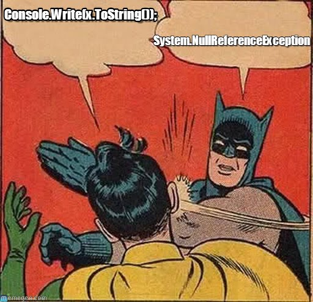

# Effective Java Notes

Progress: 

# Creating and Destroying Objects

### 1. Consider static factory methods instead of constructors

#### 1. Advantages: 
1. One advantage of static factory methods is that, unlike constructors, they have names.
2. A second advantage of static factory methods is that, unlike constructors, they are not required to create a new object each time they're invoked.
3. A third advantage of static factory methods is that, unlike constructors, they can return an object of any subtype of their return type.
4. A fourth advantage of static factory methods is that they reduce the verbosity of creating parameterized type instances.
        
#### 2. Disadvantages:
1. The main disadvantage of providing only static factory methods is that classes without public or protected constructors cannot be subclassed.
2. A second disadvantage of static factory methods is that they are not readily distinguishable from other static methods.
    

    
### 2. Consider a builder when faced with many constructor parameters

#### 1. Telescoping constructor
It is hard to write client code when there are many parameters, and harder still to read it.

#### 2. JavaBean constructor
1. It may be in an inconsistent state partway through its construction.
2. It precludes the possibility of making a class immutable
#### 3. Builder constructor
1. It simulates named optional parameters as found in Ada and Python.
2. It is a good choice when designing classes whose constructors or static factories would have more than a handful of parameters, especially if most of those parameters are optional.
    

    
### 3. Enforce the singleton property with a private constructor or an enum type
    

    
### 4. Enforce noninstantiability with a private constructor
    

    
### 5. Avoid creating unnecessary objects
1. Prefer primitives to boxed primitives. (int better than Integer)
2. Watch out for unintentional autoboxing. 
    

    
6. Eliminate obsolete object references
    1. Whenever a class manages its own memory, the programmer should be alert for memory leaks.
    2. Another common source of memory leaks is caches. (Use WeakHashMap)
    3. A third common source of memory leaks is listeners and other callbacks. (Handler.removeCallbacksAndMessages(null);)

### 7. Avoid finalizers

#### 1. Finalizers are unpredictable, often dangerous, and generally unnecessary.
1. There is no guarantee finalizers will be executed promptly
    Never do anything time-critical in a finalizer.
2. Also, it provides no guarantee that finalizers will get executed at all.
    Never depend on a finalizer to update critical persistent state.
3. If an uncaught exception is thrown during finalization: 
    1. The exception is ignored
    2. Finalization of that object terminates 
    3. It won't even print a warning
4. There is a severe performance penalty for using finalizers.

#### 2. Solution:
1. Provide an explicit termination method
2. Require clients of the class to invoke this method on each instance when it is no longer needed
3. The instance must keep track of whether it has been terminated

#### 3. Examples: FileInputStream, FileOutputStream, Timer, and Connection
    

## Methods Common to All Objects

### 8. Obey the general contract when overriding "equals": Only overiding "equals" when it is a "value class"

#### 1. Avoid overiding "equals" when:
1. Each instance of the class is inherently unique
2. You don't care whether the class provides a "logical equality" test.
3. A superclass has already overridden equals, and the superclass behavior is appropriate for this class.
4. The class is private or package-private, and you are certain that its equals method will never be invoked.

#### 2. Obey mathematical equivalency:
1. Reflexivity: a=1
2. Symmetry: a=b => b=a
3. Transitivity: a=b, b=c => a=c
4. Consistency: a=b forever
5. Non-nullity: a!=null (No object should equal to null)

#### 3. There is no way to extend an instantiable class and add a value component while preserving the equals contract.
1. Timestamp extends Date. It's a bad implementation. Don't use them together.
2. you can add a value component to a subclass of an abstract class without violating the equals contract.

#### 4. The Liskov substitution principle says that any important property of a type should also hold for its subtypes, so that any method written for the type should work equally well on its subtypes

#### 5. A good equals method should:

1. Use the == operator to check if the argument is a reference to this object.
2. Use the instanceof operator to check if the argument has the correct type.
3. Cast the argument to the correct type.
4. For each "significant" field in the class, check if that field of the argument matches the corresponding field of this object.
5. When you are finished writing your equals method, ask yourself three questions: Is it symmetric? Is it transitive? Is it consistent? (Write unit test for them)
6. Always override hashCode when you override equals
    

    
### 9. Always override hashCode when you override equals

#### 1. Equal objects must have equal hash codes. (Inequal object can have equal hash codes)
#### 2. How to compute hash code:
##### 1. Store some constant nonzero value, say, 17, in an int variable called result. 
##### 2. For each significant field f in your object (each field taken into account by the equals method, that is), do the following:
 
1. Compute an int hash code c for the field: 
    1. If the field is a boolean, compute (f ? 1 : 0). 
    2. If the field is a byte, char, short, or int, compute (int) f. 
    3. If the field is a long, compute (int) (f ^ (f > > > 32)). 
    4. If the field is a float, compute Float.floatToIntBits( f). 
    5. If the field is a double, compute Double.doubleToLongBits( f), and then hash the resulting long as in step 2. a.iii. 
    6. If the field is an object reference and this class's equals method compares the field by recursively invoking equals, recursively invoke hashCode on the field. If a more complex comparison is required, compute a "canonical representation" for this field and invoke hashCode on the canonical representation. If the value of the field is null, return 0 (or some other constant, but 0 is traditional). 
    7. If the field is an array, treat it as if each element were a separate field. That is, compute a hash code for each significant element by applying these rules recursively, and combine these values per step 2. b. If every element in an array field is significant, you can use one of the Arrays.hashCode methods added in release 1.5.
     
2. Combine the hash code c computed in step 2. a into result as follows: 
    result = 31 * result + c;
     
##### 3. Return result.

##### 4. When you are finished writing the hashCode method, ask yourself whether equal instances have equal hash codes. Write unit tests to verify your intuition! If equal instances have unequal hash codes, figure out why and fix the problem.

#### 3. If the object is immutable, use lazy initialization.
    

    
### 10. Always override toString
    

    
### 11. Override clone judiciously
1. In practice, a class that implements Cloneable is expected to provide a properly functioning public clone method.
2. In effect, the clone method functions as another constructor; you must ensure that it does no harm to the original object and that it properly establishes invariants on the clone.
3. Don't provide clone() to immutable object
4. A fine approach to object copying is to provide a copy constructor or copy factory. (It's just better than clone())

### 12. Consider implementing Comparable
1. The implementor must ensure sgn( x.compareTo( y)) == -sgn( y.compareTo( x)) for all x and y. (This implies that x.compareTo( y) must throw an exception if and only if y.compareTo( x) throws an exception.)
2. The implementor must also ensure that the relation is transitive: (x.compareTo( y) > 0 && y.compareTo( z) > 0) implies x.compareTo( z) > 0.
3. Finally, the implementor must ensure that x.compareTo( y) == 0 implies that sgn( x.compareTo( z)) == sgn( y.compareTo( z)), for all z.
4. It is strongly recommended, but not strictly required, that (x.compareTo( y) == 0) == (x.equals( y)).
5. When return a - b, be aware of integer overflow. 
\*sgn( expression) designates the mathematical signum function, which is defined to return -1, 0, or 1, according to whether the value of expression is negative, zero, or positive.

## Classes and Interfaces 

### 13. Minimize the accessibility of classes and members

Instance fields should never be public. (Otherwise, it will not be thread safe)

    
### 14. In public classes, use accessor methods, not public fields

    
### 15. Minimize mutability
1. Don't provide any methods that modify the object's state (No "set" method)
2. Ensure that the class can't be extended. (final class Blabla)
3. Make all fields final.
4. Ensure exclusive access to any mutable components. (No one can access the reference of my mutable field)
    

    
    
### 16. Favor composition over inheritance

    
### 17. Design and document for inheritance or else prohibit it

If you want to enable inheritance:

1. The class must document its self-use of overridable methods. ("This implementation ...")
2. The only way to test a class designed for inheritance is to write subclasses.
3. Constructors **must not** invoke overridable methods,
4. Don't implement "Cloneable" and "Serializable". If you must, neither "clone" nor "readObject" may invoke an overridable method, directly or indirectly.

### 18. Prefer interfaces to abstract classes
    
#### Benefits of interface
    
1. Existing classes can be easily retrofitted to implement a new interface.
2. Interfaces are ideal for defining mixins.
3. Interfaces allow the construction of nonhierarchical type frameworks.
4. Interfaces enable safe, powerful functionality enhancements via the wrapper class idiom. (**"Abstract Interface"**, or **Skeletal Implementation**)
    
#### Benefits of abstract class:
1. It is far easier to evolve an abstract class than an interface. (You can add new methods any time)
2. Once an interface is released and widely implemented, it is almost impossible to change.

### 19. Use interfaces only to define types

1. Don't do constant interface. Use util class.
2. If you use a util class too often, make static import.

        
### 20. Prefer class hierarchies to tagged classes

Tagged classes are verbose, error-prone, and inefficient.

        
### 21. Use function objects to represent strategies

(Best example: Comparator<T>)

### 22. Favor static member classes over nonstatic

There are four kinds of nested classes: 

1. Static member class (e.g. Calculator.Operation.PLUS)
2. Nonstatic member class (e.g. Map.Entry)
3. Anonymous class (e.g. new Comparator<String> {...})
4. Local class (just like a local variable)

If you declare a member class that does not require access to an enclosing instance, always put the static modifier in its declaration

    
## Generics

| Term                    	| Example                             	|     Item     	|
|-------------------------	|-------------------------------------	|:------------:	|
| Parameterized type      	| List\<String\>                      	| Item 23      	|
| Actual type parameter   	| String                              	| Item 23      	|
| Generic type            	| List\<E\>                           	| Items 23, 26 	|
| Formal type parameter   	| E                                   	| Item 23      	|
| Unbounded wildcard type 	| List\<?\>                           	| Item 23      	|
| Raw type                	| List                                	| Item 23      	|
| Bounded type parameter  	| \<E extends Number\>                	| Item 26      	|
| Recursive type bound    	| \<T extends Comparable\<T\>\>       	| Item 27      	|
| Bounded wildcard type   	| List\<? extends Number\>            	| Item 28      	|
| Generic method          	| static\<E\> List\<E\> asList(E[] a) 	| Item 27      	|
| Type token              	| String.class                        	| Item 29      	|
    
### 23. Don’t use raw types in new code

    

*Acknoledgement: Bloch, Joshua (2008-05-08). Effective Java (Java Series). Pearson Education. Kindle Edition.* 